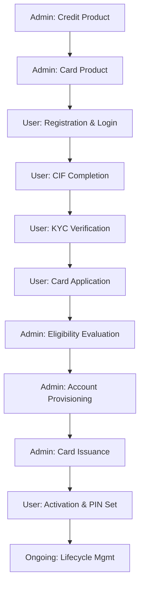

# ZBANQUe Credit Card Management System

A robust, enterprise-grade backend for managing the complete lifecycle of credit cards, credit accounts, and retail banking workflows. This system enforces strict banking standards, real-time risk assessment, and multi-stage lifecycle management.

## Table of Contents
1. [Workflow Overview](#workflow-overview)
2. [Detailed Component Flows](#detailed-component-flows)
    - [1. Administrative Product Setup](#1-administrative-product-setup)
    - [2. Customer Onboarding (CIF & KYC)](#2-customer-onboarding-cif--kyc)
    - [3. Application & Underwriting](#3-application--underwriting)
    - [4. Issuance & Activation](#4-issuance--activation)
    - [5. Account & Card Management](#5-account--card-management)
3. [API Master Reference](#api-master-reference)
4. [Tech Stack & Design Patterns](#tech-stack--design-patterns)
5. [Setup & Deployment](#setup--deployment)

---

## Workflow Overview

The system follows a strict linear progression to ensure compliance and risk mitigation:



---

## Detailed Component Flows

### 1. Administrative Product Setup
Before any user can apply, admins must define the product catalog:
- **Credit Product**: Defines the financial "soul" of the card—Interest rates (APR), Eligibility rules (min score/income), and GL accounting mappings.
- **Card Product**: Defines the physical/virtual representation—Branding, Network (Visa/Mastercard), Rewards, and Transaction Controls (Dom/Intl).

### 2. Customer Onboarding (CIF & KYC)
- **CIF (Customer Information File)**: A 5-stage profile completion (Personal, Residential, Employment, Financial, FATCA).
- **KYC (Know Your Customer)**: Security-first document upload with integrated OTP verification to bind the user's identity to their digital profile.

### 3. Application & Underwriting
- **Real-time Assessment**: Upon submission, the system runs three engines:
    - **Bureau Engine**: Simulates credit history and score checking.
    - **Fraud Engine**: Detects anomalies in income, location, and application velocity.
    - **Risk Engine**: Computes risk bands and confidence scores.
- **Underwriting**: Admins review these assessments to either move to account configuration or reject the application.

### 4. Issuance & Activation
- **Provisioning**: Approved applications are converted into `CreditAccounts` with configured limits and billing cycles.
- **Secure Activation**: Uses a "Linkage-Protected" OTP flow. 
    1. Generate an `activation_id`.
    2. Request OTP using `activation_id` as the `linkage_id`.
    3. Verify OTP.
    4. Provide the secret PIN to activate the physical/virtual card.

### 5. Account & Card Management
- **Card Actions**: Granular control via a master dispatcher (`block`, `unblock`, `replace`, `renew`, `terminate`).
- **Account Controls**: Admins can adjust limits, freeze accounts for delinquency, or update APRs dynamically.

---

## API Master Reference

### Core Workflows
| Route | Method | Purpose |
| :--- | :--- | :--- |
| `/auth/registrations` | `POST` | Create pending user registration |
| `/customers/cif/...` | `PUT` | Series of endpoints to complete CIF profile |
| `/customers/kyc` | `POST` | Upload & Verify identity documents |
| `/applications/` | `POST` | **[Apply]** Run eligibility engines and submit |
| `/card_product/{id}/card` | `POST` | **[Issue]** Create a card for a credit account |
| `/cards/{id}/activate` | `POST` | **[Activate]** 2-stage verification & PIN set |

### Administrative Controls
| Category | Endpoint | Description |
| :--- | :--- | :--- |
| **Products** | `/credit-products/` | Master Credit Product Catalog |
| **Products** | `/card-products/` | Visual/Feature Card Variants |
| **Accounts** | `/credit-accounts/{id}/status` | Lifecycle: SUSPENDED, FROZEN, CLOSED |
| **Accounts** | `/credit-accounts/{id}/limits` | Increase/Decrease Credit exposure |
| **Accounts** | `/credit-accounts/{id}/interest`| Update dynamic APR rates |

---

## Tech Stack & Design Patterns
- **Framework**: FastAPI (Asynchronous logic)
- **Database**: SQLAlchemy 2.0 (PostgreSQL/SQLite)
- **Validation**: Pydantic v2 (Strict lowercase enforcement for codes/IDs)
- **Security**: JWT-based Auth, Bcrypt Hashing, Fernet Encryption for sensitive fields.
- **Design Pattern**: Command-Query Separation (CQS) for lifecycle dispatchers.

## Setup & Deployment

1. **Environment**: Copy `.env.example` to `.env` and configure your DATABASE_URL.
2. **Migration**: Run the table synchronization scripts (or use `alembic` if configured).
3. **Run**:
```bash
uvicorn app.main:app --reload
```
Interact via the Swagger UI at: `http://127.0.0.1:8000/docs`
